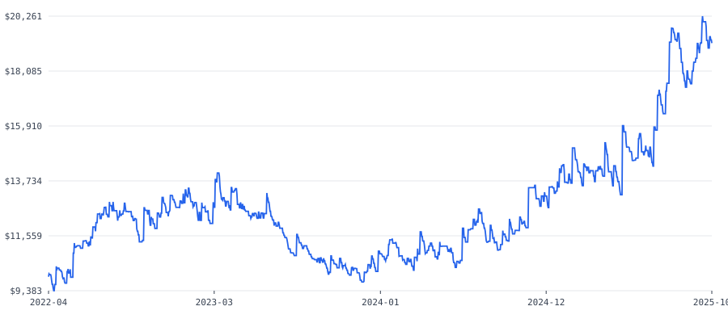
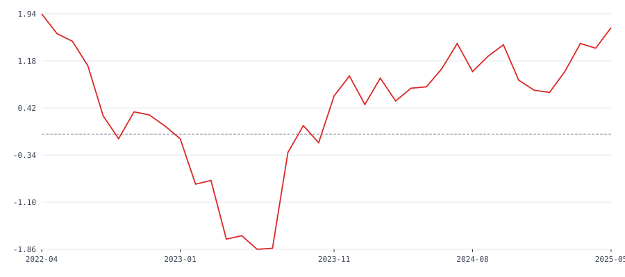

# KeltnerBreakoutVolFilter — Continuous Full-Period Diagnostic

Date: 2026-07-23
Type: **Diagnostic only.** No research decision attached. STATE.md remains "halted." No strategy code modified, no hyperparameter tuned, no acceptance criterion touched.

## Setup

- Strategy: `strategies/KeltnerBreakoutVolFilter/` — unchanged from Research Run #1, default hyperparameters (`period=20, mult=2.0, atr_period=14, atr_sma_period=20, atr_mult=2.0, risk_percent=1.5`).
- Symbol: ETH-USD, 1h, Kraken Pro Futures.
- Period: single continuous window, 2022-04-25 → 2025-10-31. No folds, no IS/OOS split, no optimizer invoked.
- Settings: futures mode, leverage 3x, 0.05% taker fee (config-verified before run), Jesse's standard candle-close fill model.
- Holdout (2025-11 → today): not touched.

### Pre-run data check

Zero-volume scan on ETH-USD 1h over the exact window (per `reports/ZERO-VOLUME-DIAGNOSIS.md` methodology): 30,864 total hours, 7 zero-volume hours (0.023%), longest streak 3 hours (2025-01-27), zero timestamp gaps. Same clean dataset used throughout Research Run #1. Cleared to run.

---

## 1. Full-period headline

| Metric | Value |
|---|---|
| Closed trades | 606 |
| Win rate | 33.33% (longs 36.21%, shorts 30.49%) |
| Sharpe ratio | **0.7478** |
| Sortino ratio | 1.4415 |
| Calmar ratio | 0.6421 |
| Total return | +91.92% ($10,000 → $19,192.49) |
| Annualized return | 20.34% |
| Max drawdown | **-31.68%** (Jesse's mark-to-market metric, includes open-position marks) |
| Max drawdown (recomputed from daily closed-trade PNL only) | -30.75%, trough 2023-12-23 |
| Max underwater period (Jesse metric) | 667 days |
| Gross profit / gross loss | $66,276.24 / -$57,083.75 |
| Profit factor (gross profit / gross loss) | 1.161 |
| Total fees paid | $6,034.02 |
| Average win / average loss | $328.10 / $141.30 |
| Longest losing streak | 15 trades |
| Execution time | 3.66s |

## 2. Equity curve

Monthly balance (last available day of each calendar month; starting balance $10,000):

| Month | Balance | Month | Balance | Month | Balance |
|---|---|---|---|---|---|
| 2022-04 | 9,947.43 | 2023-07 | 11,407.88 | 2024-10 | 12,067.51 |
| 2022-05 | 10,141.35 | 2023-08 | 11,057.09 | 2024-11 | 13,026.14 |
| 2022-06 | 11,067.68 | 2023-09 | 10,662.81 | 2024-12 | 13,244.28 |
| 2022-07 | 12,422.34 | 2023-10 | 10,453.96 | 2025-01 | 13,643.67 |
| 2022-08 | 12,552.23 | 2023-11 | 9,999.44 | 2025-02 | 14,283.28 |
| 2022-09 | 12,516.31 | 2023-12 | 10,101.82 | 2025-03 | 14,200.75 |
| 2022-10 | 12,567.61 | 2024-01 | 10,816.10 | 2025-04 | 13,883.00 |
| 2022-11 | 12,456.99 | 2024-02 | 11,093.24 | 2025-05 | 14,540.49 |
| 2022-12 | 12,686.36 | 2024-03 | 10,355.80 | 2025-06 | 14,729.21 |
| 2023-01 | 12,747.03 | 2024-04 | 10,980.53 | 2025-07 | 16,397.66 |
| 2023-02 | 12,543.54 | 2024-05 | 11,148.38 | 2025-08 | 18,976.51 |
| 2023-03 | 13,070.11 | 2024-06 | 10,480.48 | 2025-09 | 18,589.57 |
| 2023-04 | 12,664.27 | 2024-07 | 11,980.61 | 2025-10 | 19,192.49 |
| 2023-05 | 12,450.52 | 2024-08 | 11,785.91 | | |
| 2023-06 | 12,336.58 | 2024-09 | 11,377.01 | | |

Full daily-resolution balance/PNL series (1,286 days): `reports/keltner-diagnostic-daily-series.json`. Full per-trade data (606 trades): `reports/keltner-diagnostic-trades.json`.

## 3. Rolling 6-month Sharpe (stepped monthly)

Window = 182 calendar days, annualized with √365, computed on daily returns (each trade's PNL allocated to its close date, daily return = PNL / running balance). 37 overlapping windows.

| Window start | Window end | Sharpe |
|---|---|---|
| 2022-04 | 2022-09-30 | 1.941 |
| 2022-05 | 2022-10-30 | 1.621 |
| 2022-06 | 2022-11-30 | 1.499 |
| 2022-07 | 2022-12-30 | 1.103 |
| 2022-08 | 2023-01-30 | 0.295 |
| 2022-09 | 2023-03-02 | -0.073 |
| 2022-10 | 2023-04-01 | 0.360 |
| 2022-11 | 2023-05-02 | 0.311 |
| 2022-12 | 2023-06-01 | 0.134 |
| 2023-01 | 2023-07-02 | -0.074 |
| 2023-02 | 2023-08-02 | -0.806 |
| 2023-03 | 2023-08-30 | -0.747 |
| 2023-04 | 2023-09-30 | -1.693 |
| 2023-05 | 2023-10-30 | -1.637 |
| 2023-06 | 2023-11-30 | -1.857 |
| 2023-07 | 2023-12-30 | -1.840 |
| 2023-08 | 2024-01-30 | -0.295 |
| 2023-09 | 2024-03-01 | 0.139 |
| 2023-10 | 2024-03-31 | -0.138 |
| 2023-11 | 2024-05-01 | 0.618 |
| 2023-12 | 2024-05-31 | 0.939 |
| 2024-01 | 2024-07-01 | 0.479 |
| 2024-02 | 2024-08-01 | 0.904 |
| 2024-03 | 2024-08-30 | 0.536 |
| 2024-04 | 2024-09-30 | 0.742 |
| 2024-05 | 2024-10-30 | 0.763 |
| 2024-06 | 2024-11-30 | 1.056 |
| 2024-07 | 2024-12-30 | 1.462 |
| 2024-08 | 2025-01-30 | 1.010 |
| 2024-09 | 2025-03-02 | 1.256 |
| 2024-10 | 2025-04-01 | 1.442 |
| 2024-11 | 2025-05-02 | 0.870 |
| 2024-12 | 2025-06-01 | 0.709 |
| 2025-01 | 2025-07-02 | 0.675 |
| 2025-02 | 2025-08-02 | 1.013 |
| 2025-03 | 2025-08-30 | 1.463 |
| 2025-04 | 2025-09-30 | 1.387 |
| 2025-05 | 2025-10-30 | 1.719 |

Range: -1.857 (window starting 2023-06) to 1.941 (window starting 2022-04). 4 of 37 windows exceed 1.5; 6 of 37 windows are negative, all 6 concentrated between window-starts 2022-09 and 2023-08.

Full series: `reports/keltner-diagnostic-rolling-sharpe.json`.

## 4. Return per calendar quarter

| Quarter | PNL | Return % | Start balance | End balance |
|---|---|---|---|---|
| 2022-Q2 | +1,067.68 | +10.68% | 10,000.00 | 11,067.68 |
| 2022-Q3 | +1,448.63 | +13.09% | 11,067.68 | 12,516.31 |
| 2022-Q4 | +170.05 | +1.36% | 12,516.31 | 12,686.36 |
| 2023-Q1 | +383.76 | +3.02% | 12,686.36 | 13,070.11 |
| 2023-Q2 | -733.53 | -5.61% | 13,070.11 | 12,336.58 |
| 2023-Q3 | -1,673.77 | -13.57% | 12,336.58 | 10,662.81 |
| 2023-Q4 | -560.99 | -5.26% | 10,662.81 | 10,101.82 |
| 2024-Q1 | +253.98 | +2.51% | 10,101.82 | 10,355.80 |
| 2024-Q2 | +124.69 | +1.20% | 10,355.80 | 10,480.48 |
| 2024-Q3 | +896.53 | +8.55% | 10,480.48 | 11,377.01 |
| 2024-Q4 | +1,867.26 | +16.41% | 11,377.01 | 13,244.28 |
| 2025-Q1 | +956.47 | +7.22% | 13,244.28 | 14,200.75 |
| 2025-Q2 | +528.46 | +3.72% | 14,200.75 | 14,729.21 |
| 2025-Q3 | +3,860.36 | +26.21% | 14,729.21 | 18,589.57 |
| 2025-Q4 (partial, Oct only) | +602.92 | +3.24% | 18,589.57 | 19,192.49 |

4 of 15 quarters are negative: 2023-Q2, 2023-Q3, 2023-Q4 (three in a row), and no others. 2023-Q3 is the single worst quarter (-13.57%). 2025-Q3 is the single best quarter (+26.21%), alone accounting for 42% of the entire period's total dollar profit ($3,860.36 of $9,192.49).

## 5. Longest flat/drawdown stretch

**659 days** underwater, from the last equity peak on **2023-03-21** to **2025-01-08**, using the daily-balance reconstruction (peak $13,070.11 on 2023-03-21; balance did not close above that level again until early January 2025).

This overlaps directly with the three-quarter losing streak in section 4 (2023-Q2 through 2023-Q4) and the block of negative rolling-Sharpe windows in section 3 (window-starts 2022-09 through 2023-08, all ≤0.36, six of them negative, the most negative reaching -1.857).

---

## Data files

- `keltner-diagnostic-equity-curve.svg`, `keltner-diagnostic-rolling-sharpe.svg` — charts embedded above
- `keltner-diagnostic-daily-series.json` — full daily PNL/return/balance series, 1,286 days
- `keltner-diagnostic-rolling-sharpe.json` — full 37-window rolling Sharpe series
- `keltner-diagnostic-quarterly-returns.json` — quarterly table as structured data
- `keltner-diagnostic-trades.json` — all 606 closed trades with entry/exit/PNL/timestamps

## Methodology notes

- Daily returns and the resulting rolling-Sharpe/quarterly/drawdown figures are computed from closed-trade PNL allocated to close date, divided by running balance — the same method used and documented in `reports/DRYRUN.md` §5 for correlation checks, since Jesse does not expose a native daily-equity series via the MCP/API.
- This produces a max-drawdown figure (-30.75%) that differs slightly from Jesse's own reported metric (-31.68%), because Jesse's figure marks open positions to market continuously (candle-by-candle) while this reconstruction only updates balance at trade close. The headline number in section 1 is Jesse's own metric; sections 3-5 use the daily reconstruction for consistency across the whole series.
- Rolling Sharpe uses a 182-day (~6 month) window stepped by calendar month, annualized by √365 on daily returns — standard, undamped, no smoothing applied.
